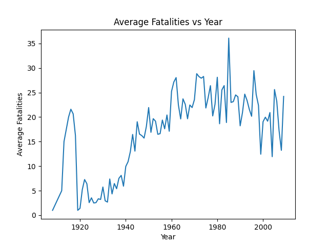
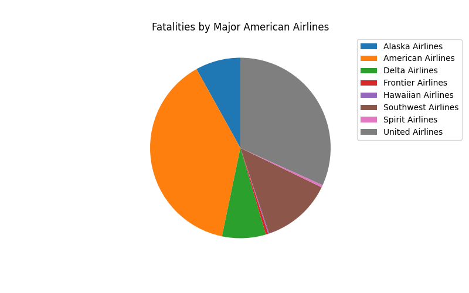

# Individual_Data_Science_Project

# Introduction

The purpose of this project is primarily to practice my skills working with data and the tools python has to offer (such as Pandas, NumPy, and Matplotlib). The secondary objective is to understand just how safe traveling by air is. I've always heard that flying is very safe, but I was curious just how safe it is. This would include the chance of death from a flight, comparing airlines by total number of fatalities, and comparing fatalities vs year.

# Selection of Data

The data selected was found on kaggle.com and is available [here](https://www.kaggle.com/datasets/saurograndi/airplane-crashes-since-1908). A copy of the csv is included in this repository.

This dataset contains information on airplane crashes since 1908 until 2009. In total, that is 5,267 data points with information on the date, time, location, operator, flight number, route, plane type, registration, construction or serial number/line or fuselage number, number of people aboard, number of fatalities, number of fatalities on the ground, and a short summary of the incident. This is a lot of information, and I luckily only had to do minimal cleaning with turning the date column from a string into a Pnadas Date-Time object.

For my project I primarily focused on the columns date, operator, number of people aboard, number of fatalities, and number of fatalities on the ground.

# Methods

The following libraries were utilized:
 - NumPy
 - Pandas
 - Matplotlib

Of these, Pandas was used the most extensively, primarily for its data frames and data manipulation. Matplotlib was used for any visualizations created, and Numpy was used for its NaN value.

# Results

From the data, I derived that there is a 0.000025% chance of death on a flight. This was found by finding the number of fatalities per day and dividing it by the total number of passengers per day [2].

Next, I looked at the Average Fatalities by Year:

As you can see, there was a large increase arond the beginning of the 1940s. My inference would be that as flights were becming more pupular, there would be an increase in fatalities simply as there were more people in the sky. What is interesting is that the graph shows the number of fatalities holding steady or even dipping slightly around 2000. This just goes to show how much work has been and continues to be put into assuring that these flights are as safe as possible.

Finally, I looked at which of the big American airlines had the most fatalities: 

The numbers of the results are as follows:
   
 - Alaska Airlines    : 337
 - American Airlines  : 1614
 - Delta Airlines     : 327
 - Frontier Airlines  : 18
 - Hawaiian Airlines  : 7
 - Southwest Airlines : 529
 - Spirit Airlines    : 17
 - United Airlines    : 1326

As you can see, the best airline to fly from a fatalities perspective is hawaiian Airlines, followed by Spirit and Frontier. This may be the case as they might not have been around as long as some of the other airlines and/or might not have the same volume of flights (more flights -> more fatalities).

# Discussion

According to [pbs](https://www.pbs.org/wgbh/nova/planecrash/risky.html)[3], there is a 0.000048% chance of death from flying. Comparing that to my 0.000025% chance, we have similar answers in the sense that we have the same order of magnitude.

This is an amazingly small number, and really highlights just how safe air travel is.

In the future, it would be intersting to look at if there is a model of plane with an abnormally large fatality rate, how seasons affect the fatalities, and if there are 'hotspot' locations for crashes.

# Summary

Flying is very safe, and looking at these numbers reinforces this conclusion.

# References

[1] https://www.kaggle.com/datasets/saurograndi/airplane-crashes-since-1908

[2] https://www.statista.com/statistics/564717/airline-industry-passenger-traffic-globally/

[3] https://www.pbs.org/wgbh/nova/planecrash/risky.html

